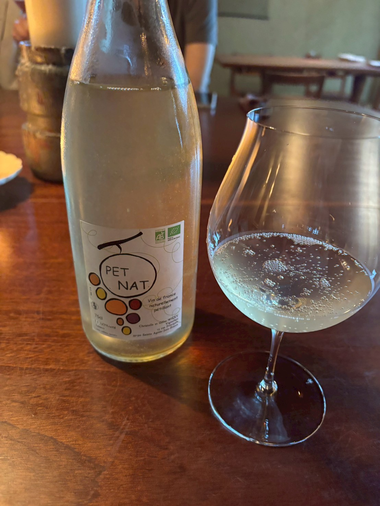
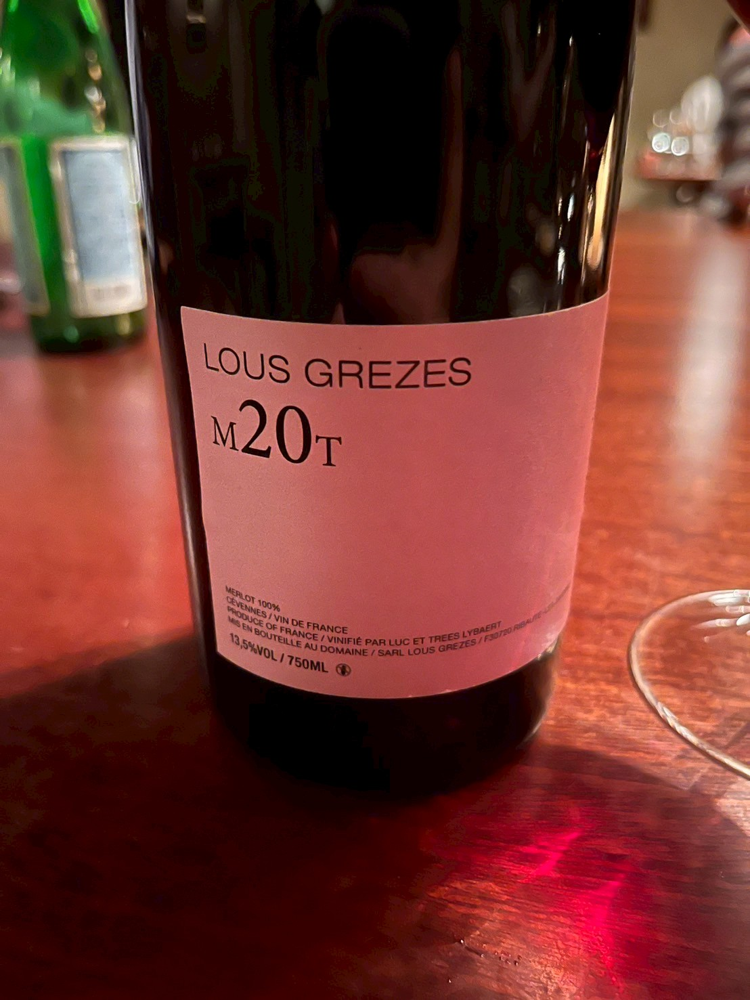
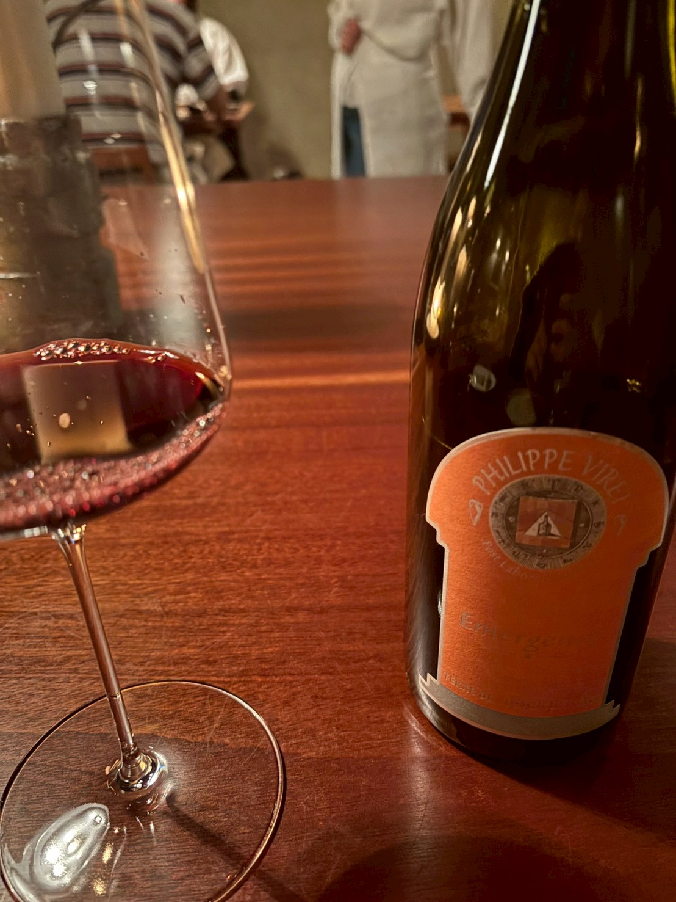

# 創作
## 友人から製作を催促される
京都漫遊中のこと、[AIによるモデル製作を進めてきた例の友人]([src/content/blog/20260521/index](https://ivix2020.github.io/my-astro-blog/blog/20260521/))からDiscordにてメッセージ。彼のVTuberチャンネル上に私のゲーム開発用チャンネルがあるのだが(何故か)、成果はまだか、進捗はどうだと催促される。

責めることはできない。耳に痛いのは何もやってないからである。あまり誤魔化してばかりもいられないし、正直に何もやっていないことを言うべきかどうか......。

聡明でインテリちっくな奴ではあるが、正直ゲーム製作についてはあまり分かってないやつなので、「ゲーム製作のペース感はそんなん違うんやで」と言ってやりたい思いもありつつ、興味が冷めて怠けているのは確かなので、あえて反論の言葉を飲み込み、これを自分への発破だと受け取って、**和室ゲー直結でなくていいから、何か技術の研鑽になるものを作りたい**ような気もしている。[^1]
# private
## 飲んだワイン
### PET NAT

- 類型：Pet Nat（Pétillant Naturel，自然氣泡酒）
- 國家：法國
- 標示：Vin de France
- 認證：AB 有機認證、EU Organic
- 容量：75cl
- 酒精濃度：11% vol
- 風格：自然派氣泡酒（naturally pétillant）
- 生產者標示：Philippe Sainte Marie（瓶身下方可見）
- 外觀：淡濁感、未完全澄清風格

> [!review] 感想 ★★★☆☆
> **スパイシー**な白ワイン。出だしがタブレだったのだが、貝割れ大根が入っていて、そのピリッとした感じとよくあった。青い感じの辛さ？が個性だと感じた。こういう感じと合いそうな料理ってこれからの季節増えてきそうな気がする。

### LOUS GREZES M20T

- 生產者：LOUS GREZES
- cuvée：M20T
- 類型：紅酒
- 葡萄品種：Merlot 100%
- 產地：Cévennes, Vin de France（法國）
- 酒精濃度：13.5%
- 容量：750ml
- 裝瓶／釀造：Luc et Threes Lybaert
- 標示年份：無標示（NV）

> [!review] 感想 ★★★★☆
> 瑞々しさ、ベリー感が強いので、赤みのある"弱火でじっくり"系のしっとり系牛肉によく合った。ソムリエの「**濃ゆい哲学のある作り手**」という謎めいたリードに惹かれて。

### Philippe Viret “Émergence” 

- 生產者：Philippe Viret
- cuvée：Émergence
- 類型：紅酒
- 產地：Terre de l’Abbé（瓶身標示）
- 國家：法國
- 容量：750ml（推定，一般標準瓶）
- 酒標特徵：橘色標籤、中心有幾何／象徵圖樣

> [!review] 感想　★★★★☆
> ボキャ貧すぎて言い表せないのが残念だが、味わい自体が複雑とかレイヤーが深いというわけではないのだが、「**一筋縄ではいかない**」個性のようなものを感じたのがこちら。ソムリエ曰く「**パワフル**」、その形容に相応しく、土地のバイタリティなのか作り手のwildさなのか、勢いのある味わいで面白い。

# Explosive Materials “PINK”

- cuvée：Explosive Materials “PINK”
- 類型：Brut Nature（零添糖氣泡酒）
- 類型補充：pink / rosé 系氣泡酒
- 國家：法國
- 容量：75cl
- 酒精濃度：11%
- 年份：2016
- 標示：contains naturally occurring sulfites
- 裝瓶者：L’égrappille（Catherine & Manuel）
- 外觀：濁りのある淡ピンク系

> [!review] ★★★☆☆
> 発酵感が強く、青草のような感じもある。ディルの香りとよくマッチしたからか、前菜のタブレとカルパッチョを盛り上げてくれた。

こういう系って好きなんだけど、ボトルで家に置きたいとならないかも。ずっと飲んでると飲み飽きするんだろうか？　というか合わせようと思うと料理を選びすぎるから、減らないのかも。

# Domaine Ribiera “Les Canilles”
- cuvée：Les Canilles
- 類型：白酒
- 類型補充：自然派白酒 / natual wine 系
- 國家：法國
- 容量：75cl（推定）
- 酒精濃度：未確認
- 年份：2023
- 標示：vendange 2023
- 生產者：Domaine Ribiera
- 外觀：微濁金黃色系
- 香氣：
  - 柑橘
  - 黃桃
  - 酵母感
  - 礦物感

> [!review] ★★★☆☆
ナチュラルワイン的製法が強く、果皮感のおかげかオレンジっぽい白。旨みが強い。俺は好き。ガス海老のフリットによくあった。

## 阪急イタリアフェア
今年もいった。大阪の`バッバルーチ`で四品いただいてそれがどれも美味だった。
自分でもシチリア料理はよく作るけど、やっぱりプロが作るものとは違う。というか案外シチリア料理は作り手によるアレンジの幅が大きいかもしれない。南部らしい自由さがありつつ、**素材主義ではあるけど実はingredientsが多く、他のイタリア南部料理が三角形だとしたら四角形、時に五角形くらい要素がある**ので、人によってバランスの取り方が違うって感じかな。

### カポナータ
甘酸っぱさの中でも、「甘い」が強かったのが印象的。夏って酸っぱいものもいいけど、意外と甘さも欲しくなるかも。俺が作るともう少し酸味が勝つのだが、これくらいレーズンの甘さを前に出してもいいかも。あとはセロリとかが控えめで（小さく、少量）上品。

### ベッカフィーコ
これも基本の材料は同じだが、パン粉がきめ細かいのか、あるいはジュースの水分を含んでいるのか、サクサク感は全くなく、その代わり鰯と果実の旨み甘みを料理に加える、純粋にフィリングとして機能している感じがあった。これも食感がスムースで、俺が作った時のようなナッツだのパン粉だののザクザク感はない。

### フェンネル団子
タオルミーナで食べた`Tischi Toschi Taormina`を思い出す。バッバルーチの人自体がそこで修行したのだから当然か。お店で食べてみたいかな。フェンネルの甘い香りがしっかり感じられておいしかった。トマトソースが異様に美味しく、相方も絶賛していた。

### レモンのアランチーニ
レモンだけを使ったアランチーニ。入っているブッラータ？ チーズも含めて塩気を効かせておらず、酒のつまみ系というよりは穏やかな前菜、あるいは箸休めという感じ。

## 読みたい本
京都で見つけた「`和の建築図案集`」。これはゲームに使えそうだ...。

# その他気になったこと
<blockquote class="bluesky-embed" data-bluesky-uri="at://did:plc:lsqf33zpsbndcchcwgoedshz/app.bsky.feed.post/3mmemsti7cs2o" data-bluesky-cid="bafyreigu5s34pjmzo2f4wiwcyr3gdunge6ag2oqzqludqxawvbjhm2w4ti" data-bluesky-embed-color-mode="system">
フォーカス台湾「国際ブッカー賞の楊双子さん「台湾の多様な声」世界に届けたい　インタビュー」 japan.focustaiwan.tw/culture/2026...  <a href="https://bsky.app/profile/did:plc:lsqf33zpsbndcchcwgoedshz/post/3mmemsti7cs2o?ref_src=embed">[image or embed]</a>
&mdash; おきらく台湾研究所 (<a href="https://bsky.app/profile/did:plc:lsqf33zpsbndcchcwgoedshz?ref_src=embed">@okiraku-tw.bsky.social</a>) <a href="https://bsky.app/profile/did:plc:lsqf33zpsbndcchcwgoedshz/post/3mmemsti7cs2o?ref_src=embed">21 May 2026 at 23:26</a></blockquote>

<blockquote class="bluesky-embed" data-bluesky-uri="at://did:plc:72nunoxaihpero364c4u7mrg/app.bsky.feed.post/3mmidkxq4dk2w" data-bluesky-cid="bafyreid2v2xkfeexoa5qiytuvv443fmoixamebtv5k2uq6anaaupm6czze" data-bluesky-embed-color-mode="system">
AIも検索エンジンもSNSも「答え」を教えてくれるが、どうも「答え」なんてものは実は存在しないらしい。じゃあこの「答え」は何なのだろう

AIも検索エンジンもSNSも忘れて、図書館へ行こう。美術館へ行こう。散歩しよう。旅に出よう。人と話そう
&mdash; 貓村ゐき Nekomura Wiki (<a href="https://bsky.app/profile/did:plc:72nunoxaihpero364c4u7mrg?ref_src=embed">@nekomura-koneko.bsky.social</a>) <a href="https://bsky.app/profile/did:plc:72nunoxaihpero364c4u7mrg/post/3mmidkxq4dk2w?ref_src=embed">23 May 2026 at 10:51</a></blockquote>

<blockquote class="bluesky-embed" data-bluesky-uri="at://did:plc:w53lkqbynr7up43cnyrld2i3/app.bsky.feed.post/3mmhylhmlv223" data-bluesky-cid="bafyreietleotjuwajgn6cxmmdm3j6ydwkcy4lc3u6j2nu43izlathwag5y" data-bluesky-embed-color-mode="system">
そしてザワークラウトもできたのです！
最高気温が20℃の環境で3日という感じでした。
ちゃんと雑味のない酸っぱい味がするので、大丈夫でしょう！
この子はあとは冷蔵庫に保存。8ヶ月くらい持つそうですね。
横から見るとぷくぷくしてますね。乳酸発酵の証かな。  <a href="https://bsky.app/profile/did:plc:w53lkqbynr7up43cnyrld2i3/post/3mmhylhmlv223?ref_src=embed">[image or embed]</a>
&mdash; わんわんお (<a href="https://bsky.app/profile/did:plc:w53lkqbynr7up43cnyrld2i3?ref_src=embed">@wanwano.bsky.social</a>) <a href="https://bsky.app/profile/did:plc:w53lkqbynr7up43cnyrld2i3/post/3mmhylhmlv223?ref_src=embed">23 May 2026 at 07:34</a></blockquote>

いいですね！

<blockquote class="text-post-media" data-text-post-permalink="https://www.threads.com/@hongdeng_2026/post/DYdXksyE6bl" data-text-post-version="0" id="ig-tp-DYdXksyE6bl" style=" background:#FFF; border-width: 1px; border-style: solid; border-color: #00000026; border-radius: 16px; max-width:650px; margin: 1px; min-width:270px; padding:0; width:99.375%; width:-webkit-calc(100% - 2px); width:calc(100% - 2px);"> <a href="https://www.threads.com/@hongdeng_2026/post/DYdXksyE6bl" style=" background:#FFFFFF; line-height:0; padding:0 0; text-align:center; text-decoration:none; width:100%; font-family: -apple-system, BlinkMacSystemFont, sans-serif;" target="_blank"> 

 <svg aria-label="Threads" height="32px" role="img" viewBox="0 0 192 192" width="32px" xmlns="http://www.w3.org/2000/svg"> <path d="M141.537 88.9883C140.71 88.5919 139.87 88.2104 139.019 87.8451C137.537 60.5382 122.616 44.905 97.5619 44.745C97.4484 44.7443 97.3355 44.7443 97.222 44.7443C82.2364 44.7443 69.7731 51.1409 62.102 62.7807L75.881 72.2328C81.6116 63.5383 90.6052 61.6848 97.2286 61.6848C97.3051 61.6848 97.3819 61.6848 97.4576 61.6855C105.707 61.7381 111.932 64.1366 115.961 68.814C118.893 72.2193 120.854 76.925 121.825 82.8638C114.511 81.6207 106.601 81.2385 98.145 81.7233C74.3247 83.0954 59.0111 96.9879 60.0396 116.292C60.5615 126.084 65.4397 134.508 73.775 140.011C80.8224 144.663 89.899 146.938 99.3323 146.423C111.79 145.74 121.563 140.987 128.381 132.296C133.559 125.696 136.834 117.143 138.28 106.366C144.217 109.949 148.617 114.664 151.047 120.332C155.179 129.967 155.42 145.8 142.501 158.708C131.182 170.016 117.576 174.908 97.0135 175.059C74.2042 174.89 56.9538 167.575 45.7381 153.317C35.2355 139.966 29.8077 120.682 29.6052 96C29.8077 71.3178 35.2355 52.0336 45.7381 38.6827C56.9538 24.4249 74.2039 17.11 97.0132 16.9405C119.988 17.1113 137.539 24.4614 149.184 38.788C154.894 45.8136 159.199 54.6488 162.037 64.9503L178.184 60.6422C174.744 47.9622 169.331 37.0357 161.965 27.974C147.036 9.60668 125.202 0.195148 97.0695 0H96.9569C68.8816 0.19447 47.2921 9.6418 32.7883 28.0793C19.8819 44.4864 13.2244 67.3157 13.0007 95.9325L13 96L13.0007 96.0675C13.2244 124.684 19.8819 147.514 32.7883 163.921C47.2921 182.358 68.8816 191.806 96.9569 192H97.0695C122.03 191.827 139.624 185.292 154.118 170.811C173.081 151.866 172.51 128.119 166.26 113.541C161.776 103.087 153.227 94.5962 141.537 88.9883ZM98.4405 129.507C88.0005 130.095 77.1544 125.409 76.6196 115.372C76.2232 107.93 81.9158 99.626 99.0812 98.6368C101.047 98.5234 102.976 98.468 104.871 98.468C111.106 98.468 116.939 99.0737 122.242 100.233C120.264 124.935 108.662 128.946 98.4405 129.507Z" /></svg>

 View on Threads

</a></blockquote>

<blockquote class="text-post-media" data-text-post-permalink="https://www.threads.com/@hongdeng_2026/post/DYg_UZJkUbx" data-text-post-version="0" id="ig-tp-DYg_UZJkUbx" style=" background:#FFF; border-width: 1px; border-style: solid; border-color: #00000026; border-radius: 16px; max-width:650px; margin: 1px; min-width:270px; padding:0; width:99.375%; width:-webkit-calc(100% - 2px); width:calc(100% - 2px);"> <a href="https://www.threads.com/@hongdeng_2026/post/DYg_UZJkUbx" style=" background:#FFFFFF; line-height:0; padding:0 0; text-align:center; text-decoration:none; width:100%; font-family: -apple-system, BlinkMacSystemFont, sans-serif;" target="_blank"> 

 <svg aria-label="Threads" height="32px" role="img" viewBox="0 0 192 192" width="32px" xmlns="http://www.w3.org/2000/svg"> <path d="M141.537 88.9883C140.71 88.5919 139.87 88.2104 139.019 87.8451C137.537 60.5382 122.616 44.905 97.5619 44.745C97.4484 44.7443 97.3355 44.7443 97.222 44.7443C82.2364 44.7443 69.7731 51.1409 62.102 62.7807L75.881 72.2328C81.6116 63.5383 90.6052 61.6848 97.2286 61.6848C97.3051 61.6848 97.3819 61.6848 97.4576 61.6855C105.707 61.7381 111.932 64.1366 115.961 68.814C118.893 72.2193 120.854 76.925 121.825 82.8638C114.511 81.6207 106.601 81.2385 98.145 81.7233C74.3247 83.0954 59.0111 96.9879 60.0396 116.292C60.5615 126.084 65.4397 134.508 73.775 140.011C80.8224 144.663 89.899 146.938 99.3323 146.423C111.79 145.74 121.563 140.987 128.381 132.296C133.559 125.696 136.834 117.143 138.28 106.366C144.217 109.949 148.617 114.664 151.047 120.332C155.179 129.967 155.42 145.8 142.501 158.708C131.182 170.016 117.576 174.908 97.0135 175.059C74.2042 174.89 56.9538 167.575 45.7381 153.317C35.2355 139.966 29.8077 120.682 29.6052 96C29.8077 71.3178 35.2355 52.0336 45.7381 38.6827C56.9538 24.4249 74.2039 17.11 97.0132 16.9405C119.988 17.1113 137.539 24.4614 149.184 38.788C154.894 45.8136 159.199 54.6488 162.037 64.9503L178.184 60.6422C174.744 47.9622 169.331 37.0357 161.965 27.974C147.036 9.60668 125.202 0.195148 97.0695 0H96.9569C68.8816 0.19447 47.2921 9.6418 32.7883 28.0793C19.8819 44.4864 13.2244 67.3157 13.0007 95.9325L13 96L13.0007 96.0675C13.2244 124.684 19.8819 147.514 32.7883 163.921C47.2921 182.358 68.8816 191.806 96.9569 192H97.0695C122.03 191.827 139.624 185.292 154.118 170.811C173.081 151.866 172.51 128.119 166.26 113.541C161.776 103.087 153.227 94.5962 141.537 88.9883ZM98.4405 129.507C88.0005 130.095 77.1544 125.409 76.6196 115.372C76.2232 107.93 81.9158 99.626 99.0812 98.6368C101.047 98.5234 102.976 98.468 104.871 98.468C111.106 98.468 116.939 99.0737 122.242 100.233C120.264 124.935 108.662 128.946 98.4405 129.507Z" /></svg>

 View on Threads

</a></blockquote>

<blockquote class="text-post-media" data-text-post-permalink="https://www.threads.com/@hongdeng_2026/post/DYk7dxyE5-7" data-text-post-version="0" id="ig-tp-DYk7dxyE5-7" style=" background:#FFF; border-width: 1px; border-style: solid; border-color: #00000026; border-radius: 16px; max-width:650px; margin: 1px; min-width:270px; padding:0; width:99.375%; width:-webkit-calc(100% - 2px); width:calc(100% - 2px);"> <a href="https://www.threads.com/@hongdeng_2026/post/DYk7dxyE5-7" style=" background:#FFFFFF; line-height:0; padding:0 0; text-align:center; text-decoration:none; width:100%; font-family: -apple-system, BlinkMacSystemFont, sans-serif;" target="_blank"> 

 <svg aria-label="Threads" height="32px" role="img" viewBox="0 0 192 192" width="32px" xmlns="http://www.w3.org/2000/svg"> <path d="M141.537 88.9883C140.71 88.5919 139.87 88.2104 139.019 87.8451C137.537 60.5382 122.616 44.905 97.5619 44.745C97.4484 44.7443 97.3355 44.7443 97.222 44.7443C82.2364 44.7443 69.7731 51.1409 62.102 62.7807L75.881 72.2328C81.6116 63.5383 90.6052 61.6848 97.2286 61.6848C97.3051 61.6848 97.3819 61.6848 97.4576 61.6855C105.707 61.7381 111.932 64.1366 115.961 68.814C118.893 72.2193 120.854 76.925 121.825 82.8638C114.511 81.6207 106.601 81.2385 98.145 81.7233C74.3247 83.0954 59.0111 96.9879 60.0396 116.292C60.5615 126.084 65.4397 134.508 73.775 140.011C80.8224 144.663 89.899 146.938 99.3323 146.423C111.79 145.74 121.563 140.987 128.381 132.296C133.559 125.696 136.834 117.143 138.28 106.366C144.217 109.949 148.617 114.664 151.047 120.332C155.179 129.967 155.42 145.8 142.501 158.708C131.182 170.016 117.576 174.908 97.0135 175.059C74.2042 174.89 56.9538 167.575 45.7381 153.317C35.2355 139.966 29.8077 120.682 29.6052 96C29.8077 71.3178 35.2355 52.0336 45.7381 38.6827C56.9538 24.4249 74.2039 17.11 97.0132 16.9405C119.988 17.1113 137.539 24.4614 149.184 38.788C154.894 45.8136 159.199 54.6488 162.037 64.9503L178.184 60.6422C174.744 47.9622 169.331 37.0357 161.965 27.974C147.036 9.60668 125.202 0.195148 97.0695 0H96.9569C68.8816 0.19447 47.2921 9.6418 32.7883 28.0793C19.8819 44.4864 13.2244 67.3157 13.0007 95.9325L13 96L13.0007 96.0675C13.2244 124.684 19.8819 147.514 32.7883 163.921C47.2921 182.358 68.8816 191.806 96.9569 192H97.0695C122.03 191.827 139.624 185.292 154.118 170.811C173.081 151.866 172.51 128.119 166.26 113.541C161.776 103.087 153.227 94.5962 141.537 88.9883ZM98.4405 129.507C88.0005 130.095 77.1544 125.409 76.6196 115.372C76.2232 107.93 81.9158 99.626 99.0812 98.6368C101.047 98.5234 102.976 98.468 104.871 98.468C111.106 98.468 116.939 99.0737 122.242 100.233C120.264 124.935 108.662 128.946 98.4405 129.507Z" /></svg>

 View on Threads

</a></blockquote>

<blockquote class="text-post-media" data-text-post-permalink="https://www.threads.com/@hongdeng_2026/post/DYk9CPKkxbm" data-text-post-version="0" id="ig-tp-DYk9CPKkxbm" style=" background:#FFF; border-width: 1px; border-style: solid; border-color: #00000026; border-radius: 16px; max-width:650px; margin: 1px; min-width:270px; padding:0; width:99.375%; width:-webkit-calc(100% - 2px); width:calc(100% - 2px);"> <a href="https://www.threads.com/@hongdeng_2026/post/DYk9CPKkxbm" style=" background:#FFFFFF; line-height:0; padding:0 0; text-align:center; text-decoration:none; width:100%; font-family: -apple-system, BlinkMacSystemFont, sans-serif;" target="_blank"> 

 <svg aria-label="Threads" height="32px" role="img" viewBox="0 0 192 192" width="32px" xmlns="http://www.w3.org/2000/svg"> <path d="M141.537 88.9883C140.71 88.5919 139.87 88.2104 139.019 87.8451C137.537 60.5382 122.616 44.905 97.5619 44.745C97.4484 44.7443 97.3355 44.7443 97.222 44.7443C82.2364 44.7443 69.7731 51.1409 62.102 62.7807L75.881 72.2328C81.6116 63.5383 90.6052 61.6848 97.2286 61.6848C97.3051 61.6848 97.3819 61.6848 97.4576 61.6855C105.707 61.7381 111.932 64.1366 115.961 68.814C118.893 72.2193 120.854 76.925 121.825 82.8638C114.511 81.6207 106.601 81.2385 98.145 81.7233C74.3247 83.0954 59.0111 96.9879 60.0396 116.292C60.5615 126.084 65.4397 134.508 73.775 140.011C80.8224 144.663 89.899 146.938 99.3323 146.423C111.79 145.74 121.563 140.987 128.381 132.296C133.559 125.696 136.834 117.143 138.28 106.366C144.217 109.949 148.617 114.664 151.047 120.332C155.179 129.967 155.42 145.8 142.501 158.708C131.182 170.016 117.576 174.908 97.0135 175.059C74.2042 174.89 56.9538 167.575 45.7381 153.317C35.2355 139.966 29.8077 120.682 29.6052 96C29.8077 71.3178 35.2355 52.0336 45.7381 38.6827C56.9538 24.4249 74.2039 17.11 97.0132 16.9405C119.988 17.1113 137.539 24.4614 149.184 38.788C154.894 45.8136 159.199 54.6488 162.037 64.9503L178.184 60.6422C174.744 47.9622 169.331 37.0357 161.965 27.974C147.036 9.60668 125.202 0.195148 97.0695 0H96.9569C68.8816 0.19447 47.2921 9.6418 32.7883 28.0793C19.8819 44.4864 13.2244 67.3157 13.0007 95.9325L13 96L13.0007 96.0675C13.2244 124.684 19.8819 147.514 32.7883 163.921C47.2921 182.358 68.8816 191.806 96.9569 192H97.0695C122.03 191.827 139.624 185.292 154.118 170.811C173.081 151.866 172.51 128.119 166.26 113.541C161.776 103.087 153.227 94.5962 141.537 88.9883ZM98.4405 129.507C88.0005 130.095 77.1544 125.409 76.6196 115.372C76.2232 107.93 81.9158 99.626 99.0812 98.6368C101.047 98.5234 102.976 98.468 104.871 98.468C111.106 98.468 116.939 99.0737 122.242 100.233C120.264 124.935 108.662 128.946 98.4405 129.507Z" /></svg>

 View on Threads

</a></blockquote>

<blockquote class="text-post-media" data-text-post-permalink="https://www.threads.com/@hongdeng_2026/post/DYk9v7iE_LN" data-text-post-version="0" id="ig-tp-DYk9v7iE_LN" style=" background:#FFF; border-width: 1px; border-style: solid; border-color: #00000026; border-radius: 16px; max-width:650px; margin: 1px; min-width:270px; padding:0; width:99.375%; width:-webkit-calc(100% - 2px); width:calc(100% - 2px);"> <a href="https://www.threads.com/@hongdeng_2026/post/DYk9v7iE_LN" style=" background:#FFFFFF; line-height:0; padding:0 0; text-align:center; text-decoration:none; width:100%; font-family: -apple-system, BlinkMacSystemFont, sans-serif;" target="_blank"> 

 <svg aria-label="Threads" height="32px" role="img" viewBox="0 0 192 192" width="32px" xmlns="http://www.w3.org/2000/svg"> <path d="M141.537 88.9883C140.71 88.5919 139.87 88.2104 139.019 87.8451C137.537 60.5382 122.616 44.905 97.5619 44.745C97.4484 44.7443 97.3355 44.7443 97.222 44.7443C82.2364 44.7443 69.7731 51.1409 62.102 62.7807L75.881 72.2328C81.6116 63.5383 90.6052 61.6848 97.2286 61.6848C97.3051 61.6848 97.3819 61.6848 97.4576 61.6855C105.707 61.7381 111.932 64.1366 115.961 68.814C118.893 72.2193 120.854 76.925 121.825 82.8638C114.511 81.6207 106.601 81.2385 98.145 81.7233C74.3247 83.0954 59.0111 96.9879 60.0396 116.292C60.5615 126.084 65.4397 134.508 73.775 140.011C80.8224 144.663 89.899 146.938 99.3323 146.423C111.79 145.74 121.563 140.987 128.381 132.296C133.559 125.696 136.834 117.143 138.28 106.366C144.217 109.949 148.617 114.664 151.047 120.332C155.179 129.967 155.42 145.8 142.501 158.708C131.182 170.016 117.576 174.908 97.0135 175.059C74.2042 174.89 56.9538 167.575 45.7381 153.317C35.2355 139.966 29.8077 120.682 29.6052 96C29.8077 71.3178 35.2355 52.0336 45.7381 38.6827C56.9538 24.4249 74.2039 17.11 97.0132 16.9405C119.988 17.1113 137.539 24.4614 149.184 38.788C154.894 45.8136 159.199 54.6488 162.037 64.9503L178.184 60.6422C174.744 47.9622 169.331 37.0357 161.965 27.974C147.036 9.60668 125.202 0.195148 97.0695 0H96.9569C68.8816 0.19447 47.2921 9.6418 32.7883 28.0793C19.8819 44.4864 13.2244 67.3157 13.0007 95.9325L13 96L13.0007 96.0675C13.2244 124.684 19.8819 147.514 32.7883 163.921C47.2921 182.358 68.8816 191.806 96.9569 192H97.0695C122.03 191.827 139.624 185.292 154.118 170.811C173.081 151.866 172.51 128.119 166.26 113.541C161.776 103.087 153.227 94.5962 141.537 88.9883ZM98.4405 129.507C88.0005 130.095 77.1544 125.409 76.6196 115.372C76.2232 107.93 81.9158 99.626 99.0812 98.6368C101.047 98.5234 102.976 98.468 104.871 98.468C111.106 98.468 116.939 99.0737 122.242 100.233C120.264 124.935 108.662 128.946 98.4405 129.507Z" /></svg>

 View on Threads

</a></blockquote>

<blockquote class="text-post-media" data-text-post-permalink="https://www.threads.com/@hongdeng_2026/post/DYk_G7ok_zz" data-text-post-version="0" id="ig-tp-DYk_G7ok_zz" style=" background:#FFF; border-width: 1px; border-style: solid; border-color: #00000026; border-radius: 16px; max-width:650px; margin: 1px; min-width:270px; padding:0; width:99.375%; width:-webkit-calc(100% - 2px); width:calc(100% - 2px);"> <a href="https://www.threads.com/@hongdeng_2026/post/DYk_G7ok_zz" style=" background:#FFFFFF; line-height:0; padding:0 0; text-align:center; text-decoration:none; width:100%; font-family: -apple-system, BlinkMacSystemFont, sans-serif;" target="_blank"> 

 <svg aria-label="Threads" height="32px" role="img" viewBox="0 0 192 192" width="32px" xmlns="http://www.w3.org/2000/svg"> <path d="M141.537 88.9883C140.71 88.5919 139.87 88.2104 139.019 87.8451C137.537 60.5382 122.616 44.905 97.5619 44.745C97.4484 44.7443 97.3355 44.7443 97.222 44.7443C82.2364 44.7443 69.7731 51.1409 62.102 62.7807L75.881 72.2328C81.6116 63.5383 90.6052 61.6848 97.2286 61.6848C97.3051 61.6848 97.3819 61.6848 97.4576 61.6855C105.707 61.7381 111.932 64.1366 115.961 68.814C118.893 72.2193 120.854 76.925 121.825 82.8638C114.511 81.6207 106.601 81.2385 98.145 81.7233C74.3247 83.0954 59.0111 96.9879 60.0396 116.292C60.5615 126.084 65.4397 134.508 73.775 140.011C80.8224 144.663 89.899 146.938 99.3323 146.423C111.79 145.74 121.563 140.987 128.381 132.296C133.559 125.696 136.834 117.143 138.28 106.366C144.217 109.949 148.617 114.664 151.047 120.332C155.179 129.967 155.42 145.8 142.501 158.708C131.182 170.016 117.576 174.908 97.0135 175.059C74.2042 174.89 56.9538 167.575 45.7381 153.317C35.2355 139.966 29.8077 120.682 29.6052 96C29.8077 71.3178 35.2355 52.0336 45.7381 38.6827C56.9538 24.4249 74.2039 17.11 97.0132 16.9405C119.988 17.1113 137.539 24.4614 149.184 38.788C154.894 45.8136 159.199 54.6488 162.037 64.9503L178.184 60.6422C174.744 47.9622 169.331 37.0357 161.965 27.974C147.036 9.60668 125.202 0.195148 97.0695 0H96.9569C68.8816 0.19447 47.2921 9.6418 32.7883 28.0793C19.8819 44.4864 13.2244 67.3157 13.0007 95.9325L13 96L13.0007 96.0675C13.2244 124.684 19.8819 147.514 32.7883 163.921C47.2921 182.358 68.8816 191.806 96.9569 192H97.0695C122.03 191.827 139.624 185.292 154.118 170.811C173.081 151.866 172.51 128.119 166.26 113.541C161.776 103.087 153.227 94.5962 141.537 88.9883ZM98.4405 129.507C88.0005 130.095 77.1544 125.409 76.6196 115.372C76.2232 107.93 81.9158 99.626 99.0812 98.6368C101.047 98.5234 102.976 98.468 104.871 98.468C111.106 98.468 116.939 99.0737 122.242 100.233C120.264 124.935 108.662 128.946 98.4405 129.507Z" /></svg>

 View on Threads

</a></blockquote>

<blockquote class="text-post-media" data-text-post-permalink="https://www.threads.com/@antonz1019/post/DYmnhnXk5vO" data-text-post-version="0" id="ig-tp-DYmnhnXk5vO" style=" background:#FFF; border-width: 1px; border-style: solid; border-color: #00000026; border-radius: 16px; max-width:650px; margin: 1px; min-width:270px; padding:0; width:99.375%; width:-webkit-calc(100% - 2px); width:calc(100% - 2px);"> <a href="https://www.threads.com/@antonz1019/post/DYmnhnXk5vO" style=" background:#FFFFFF; line-height:0; padding:0 0; text-align:center; text-decoration:none; width:100%; font-family: -apple-system, BlinkMacSystemFont, sans-serif;" target="_blank"> 

 <svg aria-label="Threads" height="32px" role="img" viewBox="0 0 192 192" width="32px" xmlns="http://www.w3.org/2000/svg"> <path d="M141.537 88.9883C140.71 88.5919 139.87 88.2104 139.019 87.8451C137.537 60.5382 122.616 44.905 97.5619 44.745C97.4484 44.7443 97.3355 44.7443 97.222 44.7443C82.2364 44.7443 69.7731 51.1409 62.102 62.7807L75.881 72.2328C81.6116 63.5383 90.6052 61.6848 97.2286 61.6848C97.3051 61.6848 97.3819 61.6848 97.4576 61.6855C105.707 61.7381 111.932 64.1366 115.961 68.814C118.893 72.2193 120.854 76.925 121.825 82.8638C114.511 81.6207 106.601 81.2385 98.145 81.7233C74.3247 83.0954 59.0111 96.9879 60.0396 116.292C60.5615 126.084 65.4397 134.508 73.775 140.011C80.8224 144.663 89.899 146.938 99.3323 146.423C111.79 145.74 121.563 140.987 128.381 132.296C133.559 125.696 136.834 117.143 138.28 106.366C144.217 109.949 148.617 114.664 151.047 120.332C155.179 129.967 155.42 145.8 142.501 158.708C131.182 170.016 117.576 174.908 97.0135 175.059C74.2042 174.89 56.9538 167.575 45.7381 153.317C35.2355 139.966 29.8077 120.682 29.6052 96C29.8077 71.3178 35.2355 52.0336 45.7381 38.6827C56.9538 24.4249 74.2039 17.11 97.0132 16.9405C119.988 17.1113 137.539 24.4614 149.184 38.788C154.894 45.8136 159.199 54.6488 162.037 64.9503L178.184 60.6422C174.744 47.9622 169.331 37.0357 161.965 27.974C147.036 9.60668 125.202 0.195148 97.0695 0H96.9569C68.8816 0.19447 47.2921 9.6418 32.7883 28.0793C19.8819 44.4864 13.2244 67.3157 13.0007 95.9325L13 96L13.0007 96.0675C13.2244 124.684 19.8819 147.514 32.7883 163.921C47.2921 182.358 68.8816 191.806 96.9569 192H97.0695C122.03 191.827 139.624 185.292 154.118 170.811C173.081 151.866 172.51 128.119 166.26 113.541C161.776 103.087 153.227 94.5962 141.537 88.9883ZM98.4405 129.507C88.0005 130.095 77.1544 125.409 76.6196 115.372C76.2232 107.93 81.9158 99.626 99.0812 98.6368C101.047 98.5234 102.976 98.468 104.871 98.468C111.106 98.468 116.939 99.0737 122.242 100.233C120.264 124.935 108.662 128.946 98.4405 129.507Z" /></svg>

 View on Threads

</a></blockquote>

<blockquote class="text-post-media" data-text-post-permalink="https://www.threads.com/@sajunguphan/post/DYm1S4pj_wb" data-text-post-version="0" id="ig-tp-DYm1S4pj_wb" style=" background:#FFF; border-width: 1px; border-style: solid; border-color: #00000026; border-radius: 16px; max-width:650px; margin: 1px; min-width:270px; padding:0; width:99.375%; width:-webkit-calc(100% - 2px); width:calc(100% - 2px);"> <a href="https://www.threads.com/@sajunguphan/post/DYm1S4pj_wb" style=" background:#FFFFFF; line-height:0; padding:0 0; text-align:center; text-decoration:none; width:100%; font-family: -apple-system, BlinkMacSystemFont, sans-serif;" target="_blank"> 

 <svg aria-label="Threads" height="32px" role="img" viewBox="0 0 192 192" width="32px" xmlns="http://www.w3.org/2000/svg"> <path d="M141.537 88.9883C140.71 88.5919 139.87 88.2104 139.019 87.8451C137.537 60.5382 122.616 44.905 97.5619 44.745C97.4484 44.7443 97.3355 44.7443 97.222 44.7443C82.2364 44.7443 69.7731 51.1409 62.102 62.7807L75.881 72.2328C81.6116 63.5383 90.6052 61.6848 97.2286 61.6848C97.3051 61.6848 97.3819 61.6848 97.4576 61.6855C105.707 61.7381 111.932 64.1366 115.961 68.814C118.893 72.2193 120.854 76.925 121.825 82.8638C114.511 81.6207 106.601 81.2385 98.145 81.7233C74.3247 83.0954 59.0111 96.9879 60.0396 116.292C60.5615 126.084 65.4397 134.508 73.775 140.011C80.8224 144.663 89.899 146.938 99.3323 146.423C111.79 145.74 121.563 140.987 128.381 132.296C133.559 125.696 136.834 117.143 138.28 106.366C144.217 109.949 148.617 114.664 151.047 120.332C155.179 129.967 155.42 145.8 142.501 158.708C131.182 170.016 117.576 174.908 97.0135 175.059C74.2042 174.89 56.9538 167.575 45.7381 153.317C35.2355 139.966 29.8077 120.682 29.6052 96C29.8077 71.3178 35.2355 52.0336 45.7381 38.6827C56.9538 24.4249 74.2039 17.11 97.0132 16.9405C119.988 17.1113 137.539 24.4614 149.184 38.788C154.894 45.8136 159.199 54.6488 162.037 64.9503L178.184 60.6422C174.744 47.9622 169.331 37.0357 161.965 27.974C147.036 9.60668 125.202 0.195148 97.0695 0H96.9569C68.8816 0.19447 47.2921 9.6418 32.7883 28.0793C19.8819 44.4864 13.2244 67.3157 13.0007 95.9325L13 96L13.0007 96.0675C13.2244 124.684 19.8819 147.514 32.7883 163.921C47.2921 182.358 68.8816 191.806 96.9569 192H97.0695C122.03 191.827 139.624 185.292 154.118 170.811C173.081 151.866 172.51 128.119 166.26 113.541C161.776 103.087 153.227 94.5962 141.537 88.9883ZM98.4405 129.507C88.0005 130.095 77.1544 125.409 76.6196 115.372C76.2232 107.93 81.9158 99.626 99.0812 98.6368C101.047 98.5234 102.976 98.468 104.871 98.468C111.106 98.468 116.939 99.0737 122.242 100.233C120.264 124.935 108.662 128.946 98.4405 129.507Z" /></svg>

 View on Threads

</a></blockquote>

[^1]: あくまで「気がする」だけである
