紙を切り抜いて力士をつくり、トントン叩いて戦わせる。そんなブラウザゲーム「紙相撲ビルダー」を、AI（Claude）と二人三脚で作って公開しました。

**遊べます → [https://ivix2020.github.io/kamizumo/](https://ivix2020.github.io/kamizumo/)**

最初の一言は「単純だけど奥が深いフリーゲームを作りたい」だけ。そこから昔遊んだFlashゲームの記憶をたどり、ゲーム性を分解し、モチーフを入れ替え、物理シミュレーションで何千番も相撲を取らせて、ようやく形になりました。この記事は、その寄り道だらけの開発記です。

---

## きっかけは、たった一行

「フリーゲームを作りたい。ブラウザで遊べて、単純だけど奥が深いものだ。」

空っぽのフォルダで、Claudeにそう投げたところから始まりました。数分後には「 **Ripple** 」という連鎖パズルが動いていました。

- 石を置くと、上下左右の石が＋1
- 4になった石は弾けて、さらに周りを＋1（連鎖するほど得点倍率アップ）
- ときどき岩が落ちてきて、盤面が埋まったら終わり

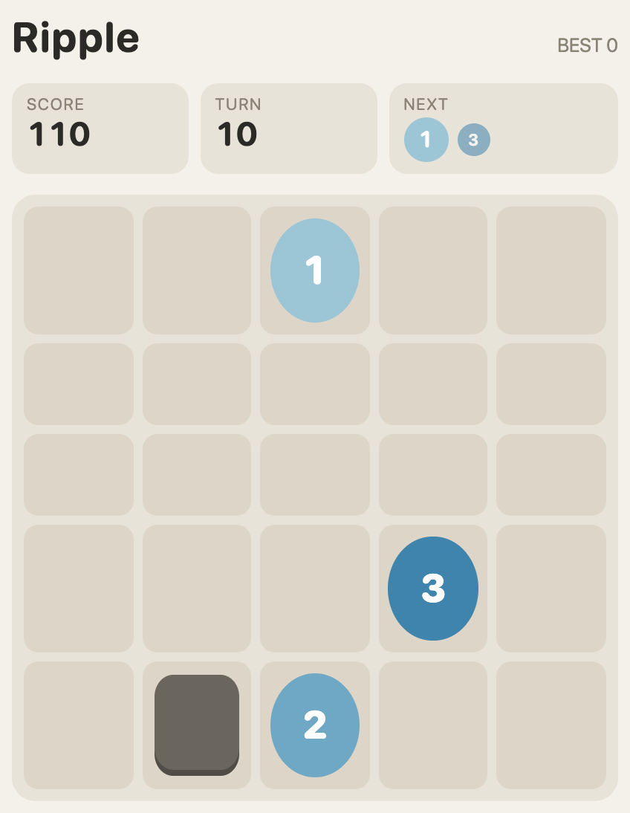

遊んでみると、ちゃんと面白い。でも「もっと面白くするには？」と聞いたあたりで、私の頭には別のゲームが浮かんでいました。

## 記憶のなかの「とつげき！戦車」

昔遊んだ「とつげき！戦車」というブラウザゲームが、妙に印象に残っていました。調べてもらうと、その名前のゲームは見つからず。候補として挙がったのが、すずぬーとさんのFlashゲーム「 **激突要塞！** 」（2008年）でした。台車に兵玉を乗せた要塞同士をぶつけ合う、あのゲームです。

そこで「激突要塞のゲーム性を研究して」と頼みました。ファンのWikiや解説記事を読み込んで分解すると、面白さの構造がくっきり見えてきます。

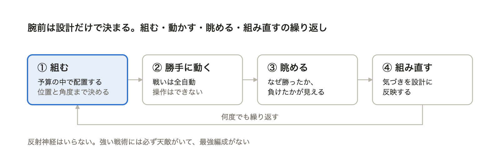

操作がないので、反射神経ではなく **設計力** だけが問われる。強い戦術には必ず天敵がいて、最強編成がない。ファンが自分で戦術を発見して名前を付けているのも、奥深さの証拠でした。

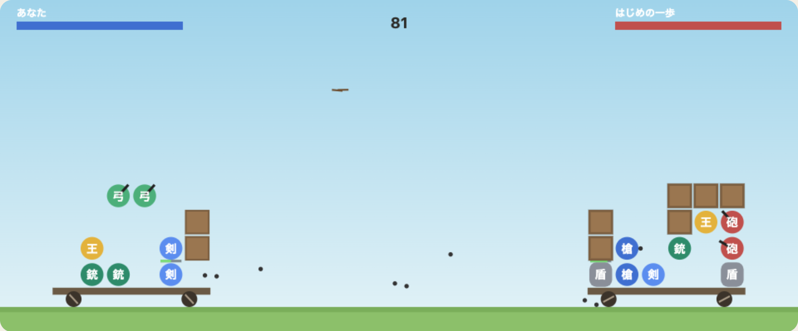

試しにこの構造を素直にまねた「ゴロゴロ要塞」も作ってもらいました。ちゃんと遊べる。でも、これはまだ「人のゲーム」です。

## 「核」だけ頂いて、作り変える

次に頼んだのは「アイデアの核だけ頂いて、オリジナルに作り変えたい。まず考えのフレームワークを出して」です。出てきたのはこんな順番でした。

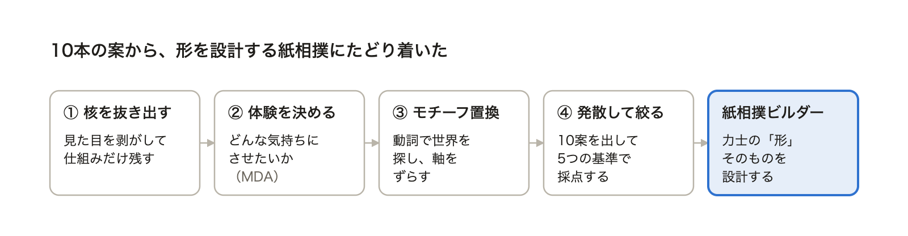

この枠組みから出てきたコンセプト案は10本。ベーゴマ工房、ドミノ合戦、怪獣をつくれ、花火合戦……。その中で一番引かれたのがこれです。

> **紙相撲ビルダー** ：自分で切り抜いた紙力士を、トントン相撲で戦わせる。

「形そのものを設計する」のが新鮮で、激突要塞から一番遠い。しかも紙がプルプル震えて押し合う絵面だけで、もう面白い。一言で「やってみ」と返しました。

## 紙で力士をつくる

仕組みはシンプルです。8×12のマス目に、 **40枚** の紙を貼って力士の形を描く。一番下の段が足の裏。土俵が自動でトントン叩かれ、力士は跳ねながら前に出ます。 **足の裏以外が土俵につくか、土俵から出たら負け** 。本物の相撲と同じルールです。物理演算には Matter.js を使いました。

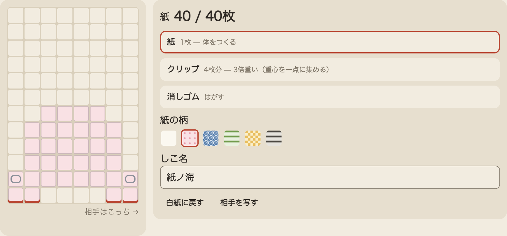

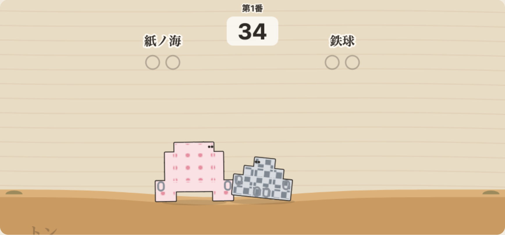

最初の試作では、どの取組も **0.5秒で決着** していました。力士がコマのように回転して、勝手に倒れていたんです。原因は、マスをたくさん繋げた物体の「回りにくさ」を物理エンジンが大幅に小さく見積もる癖。そこを自前で計算し直して、ようやく本物らしく押し合うようになりました。

次の問題は、 **運が強すぎる** こと。似た強さの形同士だと、勝敗がほぼコイントスでした。トントンの揺らぎを約40%に絞ると、「設計の差で決まる対戦」が21組中6組から11組に増えました。

ここではっきりしたのは、AIとのゲーム作りでは、 **遊んで確かめるより先に、大量に戦わせて測れる** ことです。総当たりを回せば、どの形がどれだけ強いかが数字で出ます。ただの長方形は総当たりで2勝、低く広くて重い形は36勝。形の違いが、ちゃんと勝敗を分けていました。

## 「重さ」って何だ？

「紙の枚数＝重さって、戦いに影響する？」と聞いたところ、答えは意外なものでした。 **重さそのものは、ほぼ効かない。**

土俵の振動も重力も重さに比例してかかるので、打ち消し合う。ガリレオの落下実験と同じ理屈です。形をそのままに1.5倍重くしても、17勝13敗とほぼ互角でした。効いていたのは重さの「位置」と「形」です。

- 足が狭く上が広い形は、少し傾いただけで足以外が土俵につく（0勝30敗）
- 足の真ん中を空けても安定性は変わらない。紙が4枚タダで浮く
- 上が前に張り出した形は、相手に届く前に自滅する（20敗のうち14番）

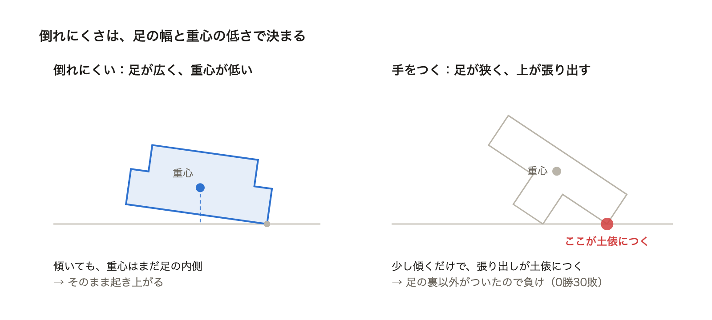

「重さに意味を持たせよう。単純にはしたくない」。ここから試行錯誤が続きました。トントンを「同じ力」にすると軽い力士が元気になり、「土俵が重さでたわむ」ようにもした。それでも、「重いほど得」か「軽いほど得」のどちらかに寄ってしまう。重さを一つの数字のままいじっても、単純さからは抜け出せませんでした。

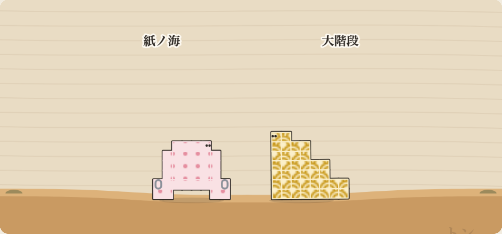

そこで足したのが、低くて重い「詰み」への答えです。

- **押さえ込み** ：相手の上に2秒乗り続けたら勝ち。背の高い力士に役割ができた
- **ヘリ（土俵際）** ：端ほどトントンが強く効く。追い詰められた側にうっちゃりの一発逆転が生まれ、引き分けは23%から16%に減った

押さえ込みは「ゲームチェンジャーすぎるから、逆の詰みを産まないか慎重に」と念を押して、総当たりで確かめました。結果は決着の約3%。切り札としてはちょうどいい控えめさです。

ちなみに途中で「鉄球強すぎない？」という事件もありました。足元にクリップを詰めた小さな力士が、番付以上に勝ちまくっていたんです。クリップの重さを紙の4倍から3倍に落とすと、勝率は80%から69%へ。それでも攻略法が思いつかず、自動探索で天敵を探してもらいました。答えは **高い壁で受け止めて、相手に崩れてもらう** 形。14勝1敗。「やれば勝てる。いいと思う」。関門として残すことにしました。

## 「ゲーム」にする

力士がそろってきて、遊び方の大枠を決める段階になりました。ここで私が考えたのは、面白さには2種類あるということです。

- **研究** ：一人の敵をどう攻略するか詰めていく楽しさ
- **連覇** ：一つの形で、どれだけ多くの敵に勝ち続けられるかの追求

一人にだけ効く形を考えるのは、実は簡単すぎます。鉄球の天敵が、機械的な探索ですぐ見つかったように。だからゲームの軸は **連戦** にしました。Claudeに質問してもらいながら、ルールを一つずつ決めていきます。

| モード | 内容 |
| --- | --- |
| 小連戦 | 番付ごとの力士3人からランダムに2人。一つの形のまま2連勝で昇進。負けたら即終了で引き直し |
| 勝ち抜き戦 | 昇進した番付の力士と、負けるまで戦い続ける |
| 稽古 | 好きな相手を選んで何度でも研究できる |

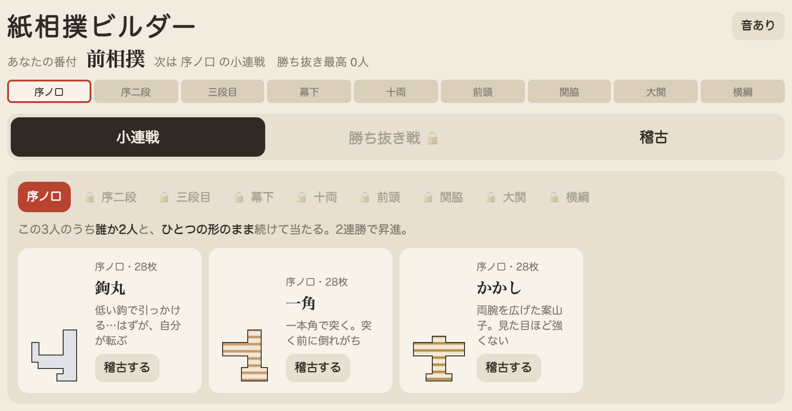

候補は見えているけれど、誰と当たるかは運。だから「この顔ぶれ全員に通用する形」を考えることになります。力士は9番付×3人の27人。新しい候補を16体作って強さを測り、番付に合うものを配置しました。

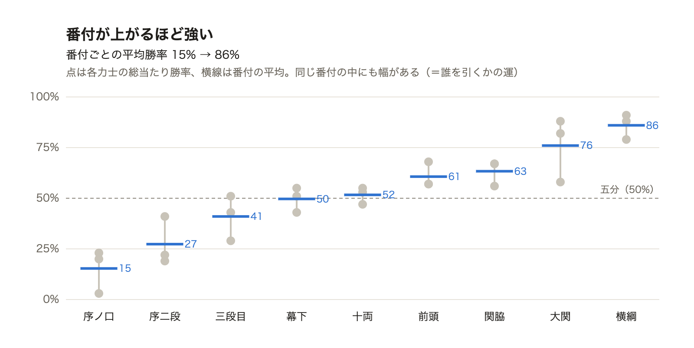

そこからは、遊びやすさの磨き込みです。

- 前相撲から横綱まで、 **自分の番付が上がっていく帯** と「昇進！」の演出
- 相手の形をサムネイルで見せるカード（作戦が立てやすい）
- 一本取ると金色の「＋1」が星取りの丸に飛び込む
- トントン、拍子木、太鼓の効果音（音声ファイルなしで、ブラウザの中で合成）
- 作った力士を6体まで保存できる枠

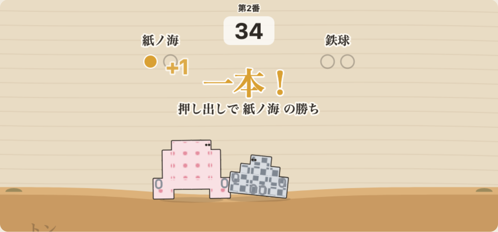

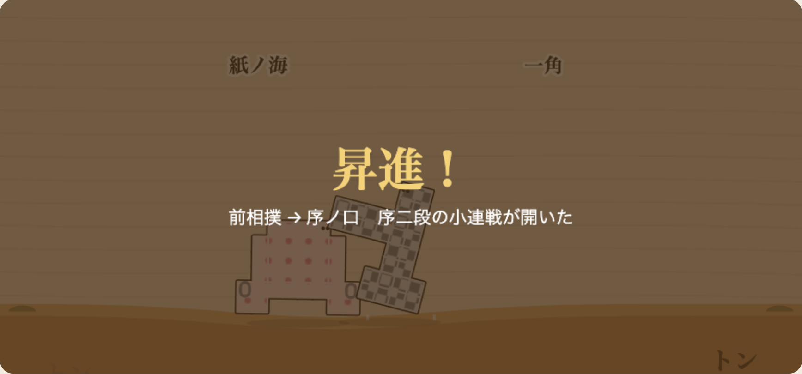

## 友達に届ける

最後は公開です。ゲームは `index.html` 一つだけなので、GitHubに置いてGitHub Pagesを有効にするだけ。pushして1、2分で、友達に送れるURLができました。

公開前に、友達には見せないものも片付けました。全力士を解放する「テストモード」は、URLに `?test` を付けたときだけ出るように。試合中の文字が力士に重なって読みにくかったのも、縁取りで直しました。

いちばん楽しみなのは「 **挑戦状URL** 」です。自分の力士の形としこ名、紙の柄がURLに詰め込まれていて、受け取った友達はその力士とその場で勝負できます。激突要塞のパスワード文化への、ちょっとしたオマージュです。

## ふりかえって

AIとゲームを作ってみて、役割分担がはっきり見えました。

- **AIが強いところ** ：試作の速さ、昔のゲームの調査と分解、そして何千番もの総当たり。「たぶん強い」を、「勝率80%」という数字にしてくれる
- **人間が決めるところ** ：何を面白いと感じるか。「単純にしたくない」「一人にだけ効く形は簡単すぎる」「鉄球強すぎない？」。方向を決めたのは、いつも遊んだ感想の一言でした

特に大きかったのは、バランス調整を「勘」ではなく「実験」でできたことです。重さが効かないという物理の理屈も、押さえ込みが新しい最強にならないことも、全部数字で確かめてから入れています。それでも、最後に「いいね」と言えるかは、自分で遊んでみるまで分かりませんでした。

まだやりたいことはあります。足の裏の面積で踏ん張りが変わる仕組みや、横綱の関門の調整。でもまずは、友達がどんな力士を送りつけてくるかが楽しみです。

よかったら、あなたの力士も送ってください。

**遊ぶ → [https://ivix2020.github.io/kamizumo/](https://ivix2020.github.io/kamizumo/)**
