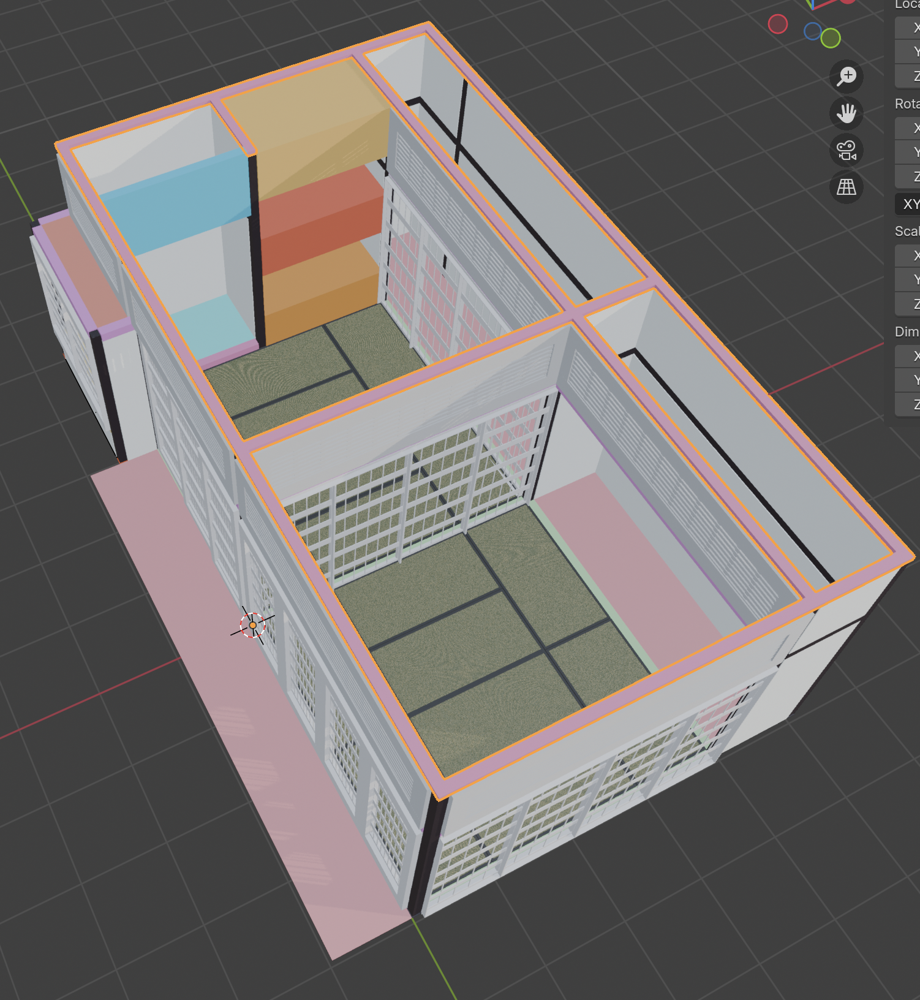

## 一応の進捗
一応、完成である。障子を配置する「障子レイアウトGN」に関しての話。

おそらく、と言うか間違いなくもっとシンプルな方法があるはず。
とはいえ、自力で作ってみてよくわかった。知見は２つ。
1. グレーボクシングは１段階作って終わりではなく、さらにそこからボクシングを重ねて（障子が入る枠をcubeで先に作る）トランスフォームが正しく適応されているかを確定してから、具体的なGroup Nodesに飛ばすようにするといい。
2. Group Nodesはこの手順を見越して、「渡されたGeometryのTransform情報及びBoxの情報のなかに綺麗に収まるよう生成する」仕組みとして作っておくことが大事だ。

先にわかっていたらもっとシンプルなノードの組み方があったはずだが、一旦良いとしよう。